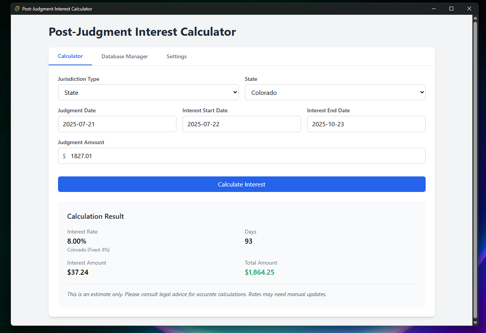
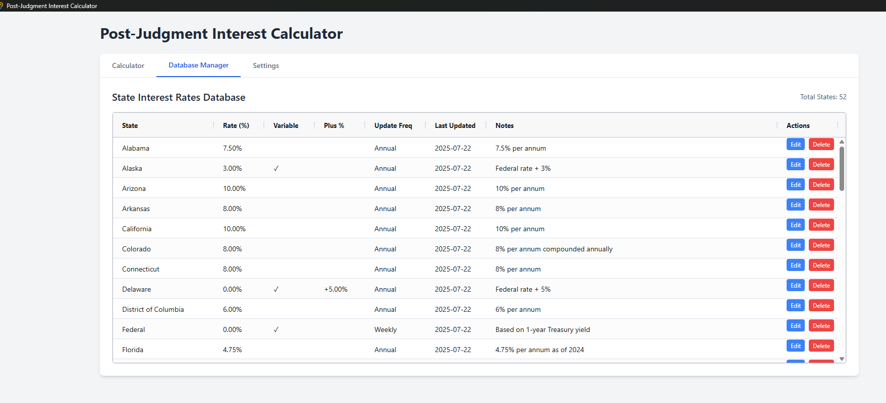
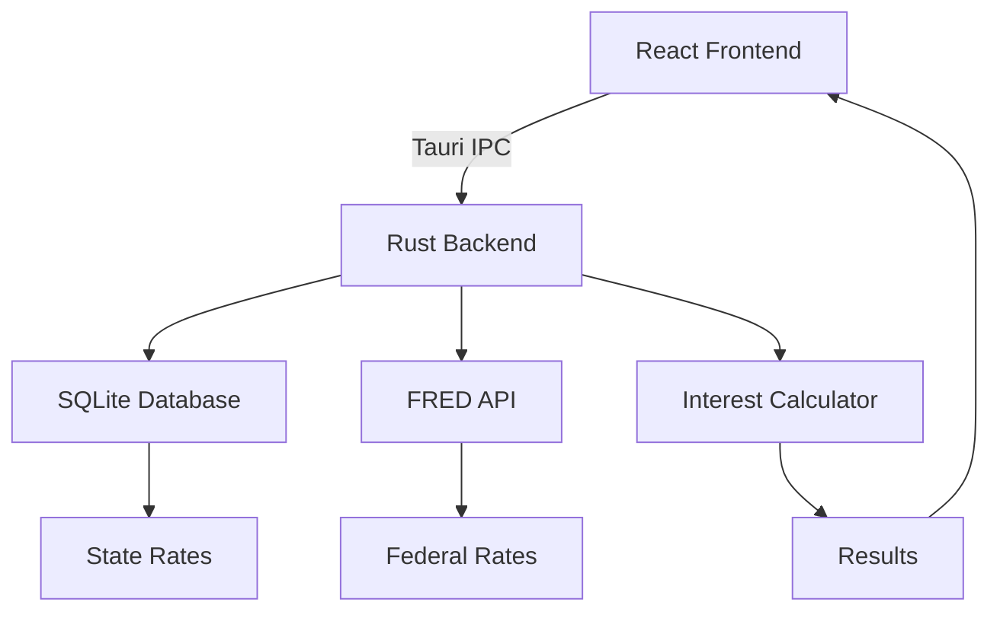

<div align="center">

# 💰 Post-Judgment Interest Calculator

### A Professional Desktop Application for Legal Interest Calculations

[](https://opensource.org/licenses/MIT)
[](https://tauri.app/)
[](https://www.rust-lang.org/)
[](https://react.dev/)
[](https://www.typescriptlang.org/)

*Calculate post-judgment interest rates for federal and state jurisdictions across the United States*

[Download Latest Release](https://github.com/matt793/JudgmentRateDesktop/releases) • [Report Bug](https://github.com/matt793/JudgmentRateDesktop/issues) • [Request Feature](https://github.com/matt793/JudgmentRateDesktop/issues)

</div>

---

## 📋 Table of Contents

- [✨ Features](#-features)
- [🖼️ Screenshots](#️-screenshots)
- [🚀 Quick Start](#-quick-start)
- [💻 Installation](#-installation)
  - [Windows MSI Installer (Recommended)](#option-1-windows-msi-installer-recommended)
  - [Build from Source](#option-2-build-from-source)
- [📖 User Guide](#-user-guide)
  - [Calculator Tab](#calculator-tab)
  - [Database Manager Tab](#database-manager-tab)
  - [Settings Tab](#settings-tab)
- [🛠️ Tech Stack](#️-tech-stack)
- [🏗️ Architecture](#️-architecture)
- [📊 How It Works](#-how-it-works)
- [🧩 Project Structure](#-project-structure)
- [🔧 Development](#-development)
- [🤝 Contributing](#-contributing)
- [📄 License](#-license)
- [🙏 Acknowledgments](#-acknowledgments)

---

## ✨ Features

<table>
<tr>
<td>

### 🏛️ **Federal Rate Calculations**
Automatically fetches real-time federal interest rates from the FRED API (1-Year Treasury Constant Maturity Rate)

### 🗺️ **All 50 States + DC**
Pre-populated database with interest rates for all U.S. jurisdictions

### ✏️ **Database Management**
Built-in UI for viewing, editing, adding, and deleting state interest rates

</td>
<td>

### 📊 **Simple Interest Formula**
Uses the standard formula: Principal × Rate × (Days / 365)

### 📅 **Flexible Date Ranges**
Calculate interest for any date range with intuitive date pickers

### 🔐 **Secure API Storage**
Local storage of FRED API key with easy configuration

</td>
</tr>
</table>

### 🌐 Cross-Platform Support
- ✅ **Windows** (MSI installer available for x64 and ARM64)
- ✅ **macOS** (Build from source)
- ✅ **Linux** (Build from source)

---

## 🖼️ Screenshots

<div align="center">
<table>
<tr>
<td align="center">
<b>📊 Calculator Tab</b><br>
<i>Calculate interest with ease</i>
</td>
<td align="center">
<b>🗃️ Database Manager</b><br>
<i>Manage state rates efficiently</i>
</td>
<td align="center">
<b>⚙️ Settings</b><br>
<i>Configure your API key</i>
</td>
</tr>
<tr>
<td></td>
<td></td>
<td></td>
</tr>
</table>
</div>

---

## 🚀 Quick Start

1. **Download** the installer from the [Releases page](https://github.com/matt793/JudgmentRateDesktop/releases)
2. **Install** the application
3. **Get your FREE API key** from [FRED](https://fred.stlouisfed.org/docs/api/api_key.html)
4. **Configure** your API key in the Settings tab
5. **Start calculating** post-judgment interest!

---

## 💻 Installation

### Option 1: Windows MSI Installer (Recommended)

<div align="center">
<table>
<tr>
<td align="center">
<h4>💿 x64 Version</h4>
<p>For most Windows PCs<br>(Intel/AMD processors)</p>
<a href="https://github.com/matt793/JudgmentRateDesktop/releases">

</a>
</td>
<td align="center">
<h4>💿 ARM64 Version</h4>
<p>For ARM-based devices<br>(Surface Pro X, etc.)</p>
<a href="https://github.com/matt793/JudgmentRateDesktop/releases">

</a>
</td>
</tr>
</table>
</div>

#### Installation Steps:

1. **Download the appropriate MSI** for your system architecture
2. **Double-click** the downloaded file to run the installer
3. **Follow** the installation wizard
4. **Launch** the app from your Start Menu

### Option 2: Build from Source

<details>
<summary><b>📦 Prerequisites</b></summary>

- [Rust](https://www.rust-lang.org/tools/install) (latest stable)
- [Node.js](https://nodejs.org/) (v18 or higher)
- [Tauri CLI](https://tauri.app/v1/guides/getting-started/prerequisites)

</details>

<details>
<summary><b>🔨 Build Steps</b></summary>

```bash
# Clone the repository
git clone https://github.com/matt793/JudgmentRateDesktop.git
cd JudgmentRateDesktop

# Install dependencies
npm install

# Run development server
npm run tauri dev

# Build for production
npm run tauri build
```

</details>

---

## 📖 User Guide

### Calculator Tab


The main interface for calculating post-judgment interest:

1. **Select Jurisdiction**: Choose between Federal or any U.S. state
2. **Enter Judgment Date**: The date the judgment was entered
3. **Enter Amount**: The principal judgment amount
4. **Select Date Range**: Choose start and end dates for interest calculation
5. **Calculate**: Click to see results including:
   - Applied interest rate
   - Number of days
   - Total interest amount
   - Legal disclaimer

> **💡 Tip**: Federal rates are fetched automatically based on the judgment date!

<br clear="right"/>

### Database Manager Tab


Manage state interest rates with an intuitive interface:

- **View** all state rates in a sortable grid
- **Edit** rates by double-clicking cells
- **Search** for specific states
- **Filter** by rate type (fixed/variable)
- **Add** new jurisdictions
- **Delete** outdated entries

**Rate Types:**
- **Fixed Rate**: A specific percentage (e.g., 8%)
- **Variable Rate**: Federal rate + additional percentage

<br clear="right"/>

### Settings Tab


Configure your FRED API key:

1. **Get your API key**:
   - Visit [FRED API Registration](https://fred.stlouisfed.org/docs/api/api_key.html)
   - Create a free account
   - Request an API key (instant approval)

2. **Enter the key** in the settings
3. **Save** to enable federal rate calculations

> **🔒 Security**: Your API key is stored locally and never transmitted except to FRED's servers.

<br clear="right"/>

---

## 🛠️ Tech Stack

<div align="center">

### Backend (Rust) 🦀
| Technology | Purpose |
|------------|---------|
| **Tauri** | Desktop application framework |
| **SQLite** | Local database via `rusqlite` |
| **reqwest** | HTTP client for FRED API |
| **chrono** | Date handling and calculations |
| **serde** | JSON serialization |
| **thiserror** | Error handling |
| **dotenvy** | Environment management |

### Frontend (TypeScript/React) ⚛️
| Technology | Purpose |
|------------|---------|
| **React** | UI framework |
| **TypeScript** | Type-safe JavaScript |
| **Vite** | Build tool and dev server |
| **Tailwind CSS** | Utility-first styling |
| **React DatePicker** | Date selection |
| **Tauri API** | Backend communication |

</div>

---

## 🏗️ Architecture



---

## 📊 How It Works

### Federal Rate Calculation

1. **Week Determination**: Identifies the week preceding the judgment date (Monday-Sunday)
2. **API Call**: Fetches daily 1-Year Treasury yields from FRED
3. **Average Calculation**: Computes average of valid yields (skips missing data)
4. **Rate Conversion**: Converts percentage to decimal

### State Rate Handling

- **Storage**: Local SQLite database
- **Types**:
  - **Fixed**: Specific percentage rate
  - **Variable**: Federal rate + additional percentage
- **Management**: Full CRUD operations via Database Manager

### Interest Calculation

```
Interest = Principal × Rate × (Days / 365)
```

- Days calculated inclusively
- Results rounded to 2 decimal places
- Includes legal disclaimer

---

## 🧩 Project Structure

```
JudgmentRateDesktop/
├── 📁 src/                      # React frontend
│   ├── 📁 components/           # UI components
│   │   ├── 📄 CalculatorTab.tsx
│   │   ├── 📄 DbManagerTab.tsx
│   │   └── 📄 SettingsTab.tsx
│   ├── 📄 App.tsx               # Main app
│   ├── 📄 types.ts              # TypeScript types
│   └── 📄 main.tsx              # Entry point
│
├── 📁 src-tauri/                # Rust backend
│   ├── 📁 src/
│   │   ├── 📄 main.rs           # App entry
│   │   ├── 📄 commands.rs       # Tauri commands
│   │   ├── 📄 db.rs             # Database ops
│   │   ├── 📄 rate_fetcher.rs   # FRED API
│   │   └── 📄 calculator.rs     # Interest calc
│   └── 📄 Cargo.toml            # Rust deps
│
├── 📁 RMImages/                 # Screenshots
└── 📄 package.json              # Node deps
```

---

## 🔧 Development

### Database Schema

```sql
CREATE TABLE state_rates (
    id INTEGER PRIMARY KEY,
    state TEXT NOT NULL UNIQUE,
    rate REAL NOT NULL,
    is_variable INTEGER NOT NULL DEFAULT 0,
    plus_percentage REAL DEFAULT 0,
    update_frequency TEXT,
    last_update TEXT,
    notes TEXT
);
```

### Running Tests

```bash
# Rust tests
cd src-tauri
cargo test

# Frontend tests
npm test
```

### Updating Dependencies

```bash
# Rust dependencies
cd src-tauri
cargo update

# Node dependencies
npm update
```

---

## 🤝 Contributing

We welcome contributions! Here's how you can help:

1. 🍴 **Fork** the repository
2. 🌿 **Create** a feature branch (`git checkout -b feature/AmazingFeature`)
3. 💾 **Commit** your changes (`git commit -m 'Add AmazingFeature'`)
4. 📤 **Push** to the branch (`git push origin feature/AmazingFeature`)
5. 🔄 **Open** a Pull Request

### Code Style

- **Rust**: Follow standard Rust formatting (`cargo fmt`)
- **TypeScript**: Use Prettier and ESLint configurations
- **Commits**: Use conventional commit messages

---

## 📄 License

This project is licensed under the MIT License - see the [LICENSE](LICENSE) file for details.

---

## 🙏 Acknowledgments

<div align="center">

Special thanks to:

🏦 **[Federal Reserve Economic Data (FRED)](https://fred.stlouisfed.org/)** for providing reliable interest rate data

🚀 **[Tauri](https://tauri.app/)** for the amazing desktop framework

⚛️ **[React](https://react.dev/)** and 🦀 **[Rust](https://www.rust-lang.org/)** communities

📚 All contributors and users of this application

</div>

---

<div align="center">

### 📧 Support

For issues, questions, or suggestions, please [open an issue](https://github.com/matt793/JudgmentRateDesktop/issues) on GitHub.

---

Made with ❤️ by [matt793](https://github.com/matt793)

</div>
